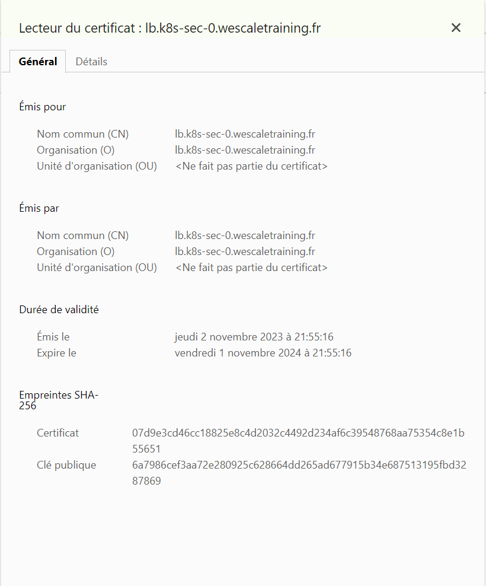

# Jour 02 - Lab 01 - Workload Hardening

## Seccomp profile

Start Pod without seccomp

```yaml
apiVersion: v1
kind: Pod
metadata:
  name: ubuntu
spec:
  containers:
  - image: ubuntu
    command:
      - sleep
      - infinity
    name: ubuntu
```

Check pod on worker node

<details>
install crictl if needed

```sh

sudo apt-get install crictl

echo "
runtime-endpoint: unix:///var/run/containerd/containerd.sock
image-endpoint: unix:///var/run/containerd/containerd.sock
timeout: 10
debug: true
" | sudo tee /etc/crictl.yaml
```

```yaml
runtime-endpoint: unix:///var/run/containerd/containerd.sock
image-endpoint: unix:///var/run/containerd/containerd.sock
timeout: 10
debug: true
```

</details>

Found your container and inspect it

```sh
sudo crictl ps


sudo crictl inspect 610ea41731124
```

### Add seccomp runtimedefault

```yaml
apiVersion: v1
kind: Pod
metadata:
  name: ubuntu-seccomp
spec:
  securityContext:
    seccompProfile:
      type: RuntimeDefault
  containers:
  - image: ubuntu
    command:
      - sleep
      - infinity
    name: ubuntu
```

### Restrict Seccomp

add a blocked seccomp profile on worker node

Audit

```json
{
    "defaultAction": "SCMP_ACT_LOG"
}
```

Fine-grained

```json
{
    "defaultAction": "SCMP_ACT_ERRNO",
    "architectures": [
        "SCMP_ARCH_X86_64",
        "SCMP_ARCH_X86",
        "SCMP_ARCH_X32"
    ],
    "syscalls": [
        {
            "names": [
                "accept4",
                "epoll_wait",
                "pselect6",
                "futex",
                "madvise",
                "epoll_ctl",
                "getsockname",
                "setsockopt",
                "vfork",
                "mmap",
                "read",
                "write",
                "close",
                "arch_prctl",
                "sched_getaffinity",
                "munmap",
                "brk",
                "rt_sigaction",
                "rt_sigprocmask",
                "sigaltstack",
                "gettid",
                "clone",
                "bind",
                "socket",
                "openat",
                "readlinkat",
                "exit_group",
                "epoll_create1",
                "listen",
                "rt_sigreturn",
                "sched_yield",
                "clock_gettime",
                "connect",
                "dup2",
                "epoll_pwait",
                "execve",
                "exit",
                "fcntl",
                "getpid",
                "getuid",
                "ioctl",
                "mprotect",
                "nanosleep",
                "open",
                "poll",
                "recvfrom",
                "sendto",
                "set_tid_address",
                "setitimer",
                "writev"
            ],
            "action": "SCMP_ACT_ALLOW"
        }
    ]
}
```

Strict

```json
{
    "defaultAction": "SCMP_ACT_ERRNO"
}
```


<details>

```sh
sudo mkdir -p /var/lib/kubelet/seccomp/profiles

echo "
{
    \"defaultAction\": \"SCMP_ACT_ERRNO\"
}
" | sudo tee /var/lib/kubelet/seccomp/profiles/violation.json 

echo "
{
    \"defaultAction\": \"SCMP_ACT_LOG\"
}
" | sudo tee /var/lib/kubelet/seccomp/profiles/audit.json 

```

</details>

Add new pod with seccomp profile violation


```yaml
apiVersion: apps/v1
kind: DaemonSet
metadata:
  name: ubuntu-seccomp-violation
spec:
  selector:
      matchLabels:
        name: ubuntu-seccomp-violation
  template:
    metadata:
      labels:
        name: ubuntu-seccomp-violation
    spec:
      securityContext:
        seccompProfile:
          type: Localhost
          localhostProfile: profiles/violation.json
      containers:
      - image: hashicorp/http-echo:1.0
        args:
        - "-text=just made some more syscalls!"
        name: ubuntu
        securityContext:
          allowPrivilegeEscalation: false
---
apiVersion: apps/v1
kind: DaemonSet
metadata:
  name: ubuntu-seccomp-audit
spec:
  selector:
      matchLabels:
        name: ubuntu-seccomp-audit
  template:
    metadata:
      labels:
        name: ubuntu-seccomp-audit
    spec:
      securityContext:
        seccompProfile:
          type: Localhost
          localhostProfile: profiles/audit.json
      containers:
      - image: hashicorp/http-echo:1.0
        args:
        - "-text=just made some more syscalls!"
        name: ubuntu
        securityContext:
          allowPrivilegeEscalation: false
```

check on worker-0

```sh
sudo tail -f /var/log/syslog | grep 'http-echo'
```

## AppArmor Configuration

Create an profile on workers

```sh
sudo apparmor_parser -q <<EOF
#include <tunables/global>

profile k8s-apparmor-example-deny-write flags=(attach_disconnected) {
  #include <abstractions/base>

  file,

  # Deny all file writes.
  deny /** w,
}
EOF
```

Start a DS to ensure you have the AppArmor profile

```yaml
apiVersion: apps/v1
kind: DaemonSet
metadata:
  name: ubuntu-apparmor
spec:
  selector:
      matchLabels:
        name: ubuntu-apparmor
  template:
    metadata:
      labels:
        name: ubuntu-apparmor
      annotations:
        container.apparmor.security.beta.kubernetes.io/ubuntu: localhost/k8s-apparmor-example-deny-write
    spec:
      containers:
      - image: ubuntu
        command:
          - sh
          - -c 
          - echo 'Hello AppArmor!' && sleep 1h
        name: ubuntu
```

Test it

```sh
kubectl exec ds/ubuntu-apparmor -c ubuntu -- cat /proc/1/attr/current

kubectl exec ds/ubuntu-apparmor -c ubuntu -- touch /tmp/test
```

## Other Configuration

### Container immutability

```yaml
apiVersion: apps/v1
kind: DaemonSet
metadata:
  name: ubuntu-immutable
spec:
  selector:
      matchLabels:
        name: ubuntu-immutable
  template:
    metadata:
      labels:
        name: ubuntu-immutable
    spec:
      securityContext:
        runAsUser: 1000
        runAsGroup: 3000
      containers:
      - image: ubuntu
        command:
          - sh
          - -c 
          - echo 'Hello AppArmor!' && sleep 1h
        name: ubuntu
        securityContext:
          readOnlyRootFilesystem: true
```

Test it

```sh
kubectl exec ds/ubuntu-immutable -c ubuntu -- touch /tmp/test
```

### Secret Limitation

```sh
kubectl create secret generic db-user-pass --from-literal=username=admin --from-literal=password='admin'
```

Retreive your secret

```sh
kubectl exec -it -n kube-system etcd-master-0 -- sh -c "
ETCDCTL_API=3 etcdctl get /registry/secrets/default/db-user-pass \
 --cert /etc/kubernetes/pki/etcd/peer.crt \
 --key /etc/kubernetes/pki/etcd/peer.key \
 --cacert /etc/kubernetes/pki/etcd/ca.crt \
 --endpoints https://etcd-master-0:2379" | hexdump -C
```

> https://developer.hashicorp.com/vault/tutorials/kubernetes/kubernetes-sidecar

### Ingress TLS

Prepare env

```sh
helm upgrade --install ingress-nginx ingress-nginx \
  --set controller.kind=DaemonSet --set controller.hostPort.enabled=true \
  --set controller.service.enabled=false \
  --repo https://kubernetes.github.io/ingress-nginx \
  --namespace ingress-nginx --create-namespace
```

Generate custom private certs

```sh
mkdir certs
export MY_PROJECT="0"
export CERT_FILE="./certs/server.crt"
export KEY_FILE="./certs/server.key"
export HOST="lb.k8s-sec-$MY_PROJECT.wescaletraining.fr"

openssl req -x509 -nodes -days 365 -newkey rsa:2048 -keyout ${KEY_FILE} -out ${CERT_FILE} -subj "/CN=${HOST}/O=${HOST}" -addext "subjectAltName = DNS:${HOST}"
```

Create ingress with certs

```sh
kubectl create secret tls testsecret-tls --key ${KEY_FILE} --cert ${CERT_FILE}
```

<details>

```yaml
apiVersion: networking.k8s.io/v1
kind: Ingress
metadata:
  name: tls-example-ingress
spec:
  ingressClassName: nginx
  tls:
  - hosts:
      - lb.k8s-sec-$MY_PROJECT.wescaletraining.fr
    secretName: testsecret-tls
  rules:
  - host: lb.k8s-sec-$MY_PROJECT.wescaletraining.fr
    http:
      paths:
      - path: /
        pathType: Prefix
        backend:
          service:
            name: service-nginx
            port:
              number: 80
---
apiVersion: apps/v1
kind: Deployment
metadata:
  name: my-nginx
spec:
  selector:
    matchLabels:
      run: my-nginx
  replicas: 2
  template:
    metadata:
      labels:
        run: my-nginx
    spec:
      containers:
      - name: my-nginx
        image: nginx
        ports:
        - containerPort: 80
---
apiVersion: v1
kind: Service
metadata:
  name: my-nginx
  labels:
    run: my-nginx
spec:
  ports:
  - port: 80
    protocol: TCP
  selector:
    run: my-nginx
```



</details>

Connect to your lb

```sh
echo "https://lb.k8s-sec-$MY_PROJECT.wescaletraining.fr/"
```


and check certs

## Clean Up

```sh

kubectl delete po ubuntu --force=true --ignore-not-found=true
kubectl delete ds ubuntu-seccomp --force=true --ignore-not-found=true
kubectl delete ds ubuntu-seccomp-violation --force=true --ignore-not-found=true


kubectl delete secret db-user-pass --force=true --ignore-not-found=true
```